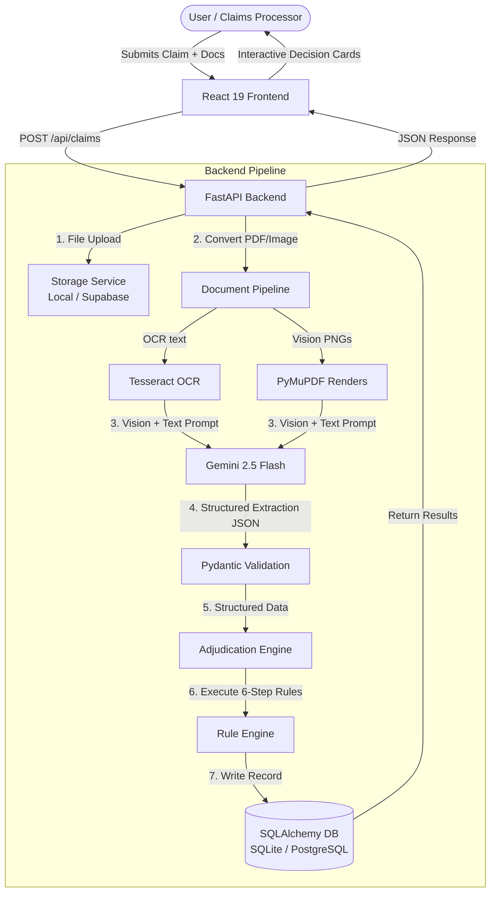
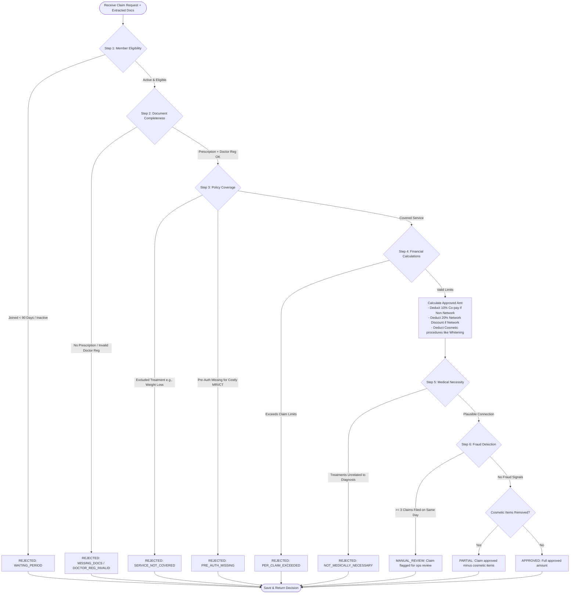

# Intelligent OPD Claim Adjudication Tool

AI-powered Outpatient Department (OPD) health insurance claims adjudication engine. It automates the review of claim submissions, doctor prescriptions, medical bills, and diagnosis reports, deciding whether a claim should be **Approved**, **Rejected**, **Partially Approved**, or flagged for **Manual Review** in under 10 seconds.

---

## 🏗️ System Architecture

The tool is split into a **FastAPI backend** (incorporating Google Gemini 2.5 Flash and SQLAlchemy) and a **React 19 + TypeScript frontend** (styled with Tailwind CSS).



### Key Architectural Rationale
1. **AI Extracts, Rules Decide**: Gemini is utilized strictly for document understanding and converting unstructured information (PDFs/Images) into structured, typed data via Pydantic. The final approval/rejection decision is executed by a deterministic, rule-based Python engine. This ensures absolute auditability, safety, and testing reliability.
2. **Dual-Modality OCR**: By passing both the raw extracted text and visual page renders (images) of documents to Gemini, the system dramatically reduces hallucinations regarding critical numbers, such as financial sums and doctor registration identifiers.
3. **Database Portability**: Built with SQLAlchemy 2.0 async engines, the application can switch from local zero-configuration SQLite to PostgreSQL (such as Supabase) simply by swapping the `DATABASE_URL` environment variable.

---

## ⚙️ Setup Instructions

### Prerequisites
* **Python**: 3.12+ (Ensure Python is added to your system `PATH`)
* **Node.js**: 20+ and **npm**
* **Tesseract OCR**: 
  * **Windows**: Install the installer from [UB-Mannheim Tesseract Wiki](https://github.com/UB-Mannheim/tesseract/wiki) and note the installation path (usually `C:\Program Files\Tesseract-OCR\tesseract.exe`).
  * **macOS**: `brew install tesseract`
  * **Linux**: `sudo apt-get install tesseract-ocr`

---

### Backend Setup

1. **Navigate to the backend folder**:
   ```bash
   cd backend
   ```

2. **Create a virtual environment and activate it**:
   * **Windows (PowerShell)**:
     ```powershell
     python -m venv .venv
     .venv\Scripts\Activate.ps1
     ```
   * **macOS/Linux**:
     ```bash
     python3 -m venv .venv
     source .venv/bin/activate
     ```

3. **Install dependencies**:
   ```bash
   pip install -r requirements.txt
   ```

4. **Configure environment variables**:
   Create a `.env` file in the `backend/` directory (you can copy `.env.example` as a starting point):
   ```ini
   GEMINI_API_KEY=your_gemini_api_key_here
   ENVIRONMENT=development
   DATABASE_URL=sqlite+aiosqlite:///./claimiq.db
   TESSERACT_CMD=C:\Program Files\Tesseract-OCR\tesseract.exe
   CORS_ORIGINS=http://localhost:5173
   ```
   > [!IMPORTANT]
   > Replace `your_gemini_api_key_here` with a valid Google AI Studio Gemini API Key.
   > Ensure `TESSERACT_CMD` points to your local Tesseract executable.

5. **Run the backend server**:
   ```bash
   uvicorn app.main:app --reload
   ```
   The backend API will run at `http://localhost:8000`. The DB tables are automatically created, and 10 default members (`EMP001` through `EMP010`) are seeded on startup.

---

### Frontend Setup

1. **Navigate to the frontend folder**:
   ```bash
   cd ../frontend
   ```

2. **Install dependencies**:
   ```bash
   npm install
   ```

3. **Configure API endpoint**:
   Create a `.env` file in the `frontend/` directory (optional - defaults to localhost if omitted):
   ```ini
   VITE_API_BASE_URL=http://localhost:8000
   ```

4. **Run the React dev server**:
   ```bash
   npm run dev
   ```
   The frontend UI will run at `http://localhost:5173`.

---

## ⚖️ Claim Adjudication Engine Flow

The engine processes claims through **six distinct sequential verification steps**. If any step fails, the processing stops and immediately returns the appropriate rejection reason.



---

## 📋 API Documentation

### System
* **`GET /api/health`**: Health check.
* **`GET /api/policy`**: Returns the loaded `policy_terms.json` rules configuration.

### Members
* **`GET /api/members`**: Retrieves the list of all seeded employee members (`EMP001` - `EMP010`) along with their joined dates and YTD claim expenditures.

### Claims Management
* **`POST /api/claims`**: Submit a claim.
  * **Content-Type**: `multipart/form-data`
  * **Payload Parameters**:
    * `member_id` (string, required)
    * `treatment_date` (date, required)
    * `claim_amount` (float, required)
    * `hospital_name` (string, optional)
    * `cashless_request` (boolean, optional)
    * `pre_auth_provided` (boolean, optional)
    * `previous_claims_same_day` (integer, optional)
    * `files` (list of files, required, supports PDF, PNG, JPG, WEBP)
  * **Returns**: Adjudication outcome including approved amounts, deductions breakdown, and rule matrix logs.
* **`GET /api/claims`**: Retrieves a paginated list of claim history. Filters by `status` or `member_id` are supported.
* **`GET /api/claims/{claim_id}`**: Fetches details for a single claim record including raw OCR text and structured JSON elements parsed by Gemini.
* **`POST /api/claims/{claim_id}/appeal`**: Appeal a rejected or partially approved claim.
  * **Payload**: `{"note": "User appeal description text"}`
  * **Returns**: Claim with status updated to `MANUAL_REVIEW`.

### Dashboard
* **`GET /api/stats`**: Aggregates metrics including total claims processed, distribution counts (Approved, Rejected, Partial, Manual Review), average confidence scores, and total approved financial outflows.

---

## 🎯 Verification and Test Cases

A suite of 10 test cases covering various positive, negative, and edge-case scenarios has been included in the codebase under `backend/data/test_cases.json`.

Mock PDF documents generated specifically for these test cases are available in [backend/data/mocks/](file:///d:/Projekts/Plum/claimiq/backend/data/mocks). You can upload these files in the frontend UI to verify the engine:

| Test Case ID | Member | Document Files to Upload | Scenario / Rule Tested | Expected Decision |
|---|---|---|---|---|
| **TC_001** | `EMP001` | `tc001_prescription.pdf` & `tc001_bill.pdf` | Standard viral fever allopathic consultation & medication | **APPROVED** (₹1,350 approved after 10% co-payment) |
| **TC_002** | `EMP002` | `tc002_prescription.pdf` & `tc002_bill.pdf` | Dental treatment including root canal and cosmetic teeth whitening | **PARTIAL** (₹8,000 approved; ₹4,000 cosmetic whitening rejected) |
| **TC_003** | `EMP003` | `tc003_prescription.pdf` & `tc003_bill.pdf` | High consultation fee exceeding the ₹5,000 per-claim limit | **REJECTED** (`PER_CLAIM_EXCEEDED`) |
| **TC_004** | `EMP004` | `tc004_bill.pdf` (no prescription uploaded) | Missing doctor's prescription | **REJECTED** (`MISSING_DOCUMENTS`) |
| **TC_005** | `EMP005` | `tc005_prescription.pdf` & `tc005_bill.pdf` | Diabetes treatment submitted by member during their initial 90-day waiting period | **REJECTED** (`WAITING_PERIOD`) |
| **TC_006** | `EMP006` | `tc006_prescription.pdf` & `tc006_bill.pdf` | Ayurvedic consultation and panchakarma treatment (AYUSH category) | **APPROVED** (₹3,500 approved with zero co-payment co-pay exemption) |
| **TC_007** | `EMP007` | `tc007_prescription.pdf` & `tc007_bill.pdf` | High-cost brain MRI (₹12,000) submitted without prior pre-authorization | **REJECTED** (`PRE_AUTH_MISSING`) |
| **TC_008** | `EMP008` | `tc008_prescription.pdf` & `tc008_bill.pdf` | User claims 3 previous submissions in the same day (Anti-fraud check) | **MANUAL_REVIEW** (`MANUAL_REVIEW`) |
| **TC_009** | `EMP009` | `tc009_prescription.pdf` & `tc009_bill.pdf` | Cosmetic bariatric weight-loss surgery (excluded policy treatment) | **REJECTED** (`SERVICE_NOT_COVERED`) |
| **TC_010** | `EMP010` | `tc010_prescription.pdf` & `tc010_bill.pdf` | Treatment received at Fortis Healthcare (recognized network hospital) | **APPROVED** (₹1,600 approved after 20% network discount) |

To run the automated Python backend tests verifying the adjudication rules:
```bash
cd backend
pytest -v
```

---

## 📌 Assumptions Made

1. **Authentication Scope**: As this is an internal demo/proof-of-concept application built to evaluate claim adjudication workflows, user authentication/roles are omitted. All submissions and histories are accessible.
2. **Doctor Registration Verification**: Doctor registration numbers are validated using regular expressions. Standard Indian medical registrations (e.g. `KA/45678/2015`) and AYUSH practitioner registrations (e.g. `AYUR/KL/2345/2019`) are supported.
3. **Alternative Medicine (AYUSH)**: Ayurveda, Homeopathy, Unani, and Yoga/Panchakarma treatments are covered under policy terms with zero co-payment (100% reimbursement) when prescribed by a doctor with a valid AYUSH registration.
4. **Dental Sub-limits**: Standard claims are capped at ₹5,000 per claim. However, dental treatments (as identified by diagnosis keyword or procedure keyword matching) qualify for a higher sub-limit of ₹10,000 per claim.
5. **Medical Necessity Model Prompting**: The LLM acts as an assistant to evaluate if the prescribed drugs/procedures fit the diagnosis. A single-word constrained output response (`YES`/`NO`) is requested to keep the rule engine's input processing reliable.
6. **Network Hospital Discounts**: Pre-negotiated network rates allow for a 20% flat discount on cashless submissions at recognized network chains (such as Apollo, Fortis, Max, Manipal, Narayana Health).
